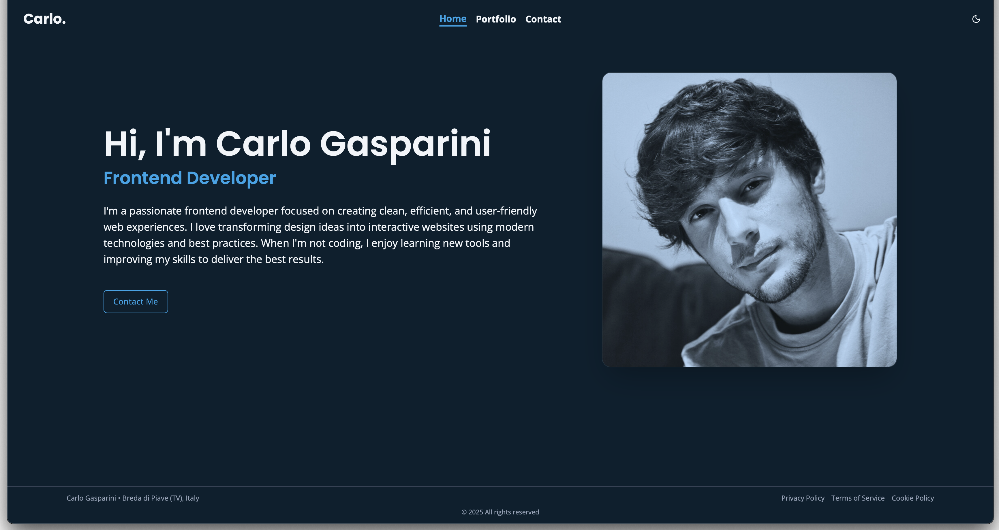

# 🧑‍💻 Carlo Gasparini — Developer Portfolio



A modern, responsive portfolio website to showcase my projects, skills, and contact information as a software developer. Built with performance and clarity in mind, the site features a clean design, seamless navigation, and a dynamic project showcase.

## ✨ Key Features

- 💼 **Project Showcase**
  - Display of selected projects with tech stack, descriptions, and links
  - Clear and professional layout
- 🎨 **Modern UI**
  - Accessible design built with **shadcn/ui** and **Tailwind CSS**
  - Fully supports light and dark themes
- 📱 **Fully Responsive**
  - Smooth experience across all devices: desktop, tablet, and mobile
- 🧠 **Dynamic Content**
  - Routing via React Router
  - Dynamic page titles and meta descriptions
- 📧 **Contact Form**
  - Send emails directly from the site
  - Includes validation and toast notifications

## 🛠️ Tech Stack

| Technology                                                                                                               | Purpose             |
| ------------------------------------------------------------------------------------------------------------------------ | ------------------- |
|                       | Frontend Framework  |
|                          | Build Tool          |
|       | Utility-first CSS   |
|  | Routing             |
|          | UI Components       |
| Sonner                                                                                                                   | Toast Notifications |
| EmailJS / SendGrid                                                                                                       | Email Sending       |

## 🚀 Getting Started

### Prerequisites

- Node.js v18+
- npm, pnpm, or yarn installed

### Installation

1. Clone the repository

```bash
git clone https://github.com/CarloGaspa/portfolio-main.git
cd portfolio-main
```

2. Install dependencies

```bash
npm install
```

3. Create a .env.local file in the root of your project and add the following:

```bash
# .env.local

# Telegram
VITE_TELEGRAM_TOKEN=your_telegram_bot_token
VITE_TELEGRAM_ID=your_telegram_chat_id

# Email (server-side only, do NOT expose these in the frontend)
VITE_SENDGRID_API_KEY=your_sendgrid_api_key
VITE_VERIFIED_SENDER=your_verified_sender_email
VITE_TARGET_EMAIL=your_target_email
```

### Running the App

```bash
npm run dev
```

Open [http://localhost:5173](http://localhost:5173) to view the app in your browser.

## 📄 License

This project is licensed under the MIT License.
